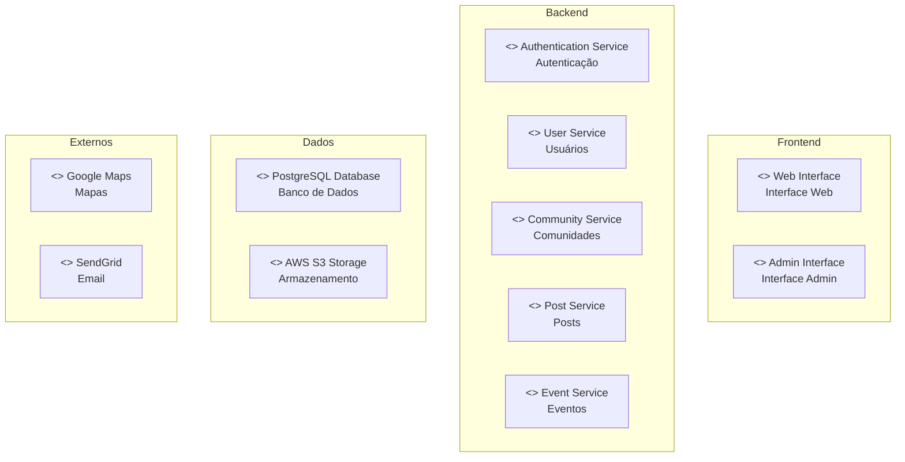
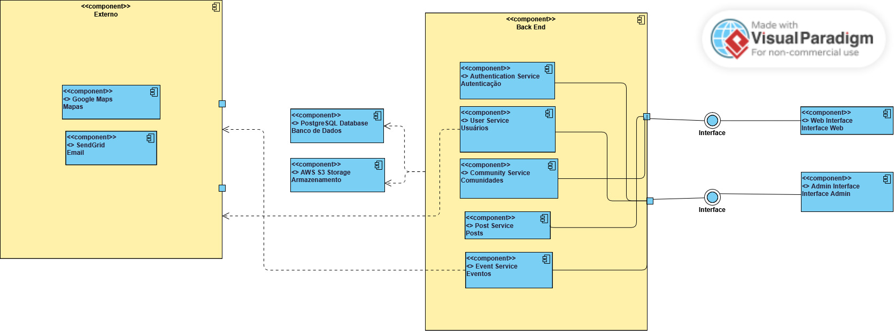

# Diagrama UML de Componentes

## Introdução

O diagrama de componentes UML representa a estrutura física e lógica de sistemas através de componentes que encapsulam funcionalidades específicas e suas interfaces de comunicação. Este diagrama mostra como os diferentes módulos do sistema interagem entre si, definindo as responsabilidades de cada componente e os contratos de comunicação.

## Metodologia

A criação do diagrama de componentes foi baseada na análise dos requisitos e da prototipação realizada na entrega anterior e modelado na plataforma Mermaid, sendo possível vizualizar atravéz do [link](https://www.mermaidchart.com/app/projects/0c66e4cf-8fd3-44c4-a270-70529e43d6ef/diagrams/75a97384-f006-4268-a14f-545db5d78772/version/v0.1/edit)

## Diagrama de Componentes

O diagrama de componentes ilustra a arquitetura da aplicação "Revele seu Hobbie". Ele descreve os principais blocos de software do sistema, suas responsabilidades e as relações de dependência entre eles.

<figcaption>Figura 1: Diagrama de componentes</figcaption>

## Descrição dos Componentes

### Frontend

#### Web Interface
- **Responsabilidade**: Interface principal do usuário
- **Funcionalidades**: Login, cadastro, feed, comunidades, posts, eventos

#### Admin Interface
- **Responsabilidade**: Interface administrativa
- **Funcionalidades**: Dashboard, moderação, gerenciamento de usuários

### Backend

#### Authentication Service
- **Responsabilidade**: Autenticação e autorização
- **Funcionalidades**: Login, logout, cadastro, recuperação de senha

#### User Service
- **Responsabilidade**: Gerenciamento de usuários
- **Funcionalidades**: CRUD de usuários, perfis, configurações

#### Community Service
- **Responsabilidade**: Gerenciamento de comunidades
- **Funcionalidades**: CRUD de comunidades, membros, moderação

#### Post Service
- **Responsabilidade**: Gerenciamento de posts
- **Funcionalidades**: CRUD de posts, upload de mídia, curtidas

#### Event Service
- **Responsabilidade**: Gerenciamento de eventos
- **Funcionalidades**: CRUD de eventos, participantes, localização

### Dados

#### PostgreSQL Database
- **Responsabilidade**: Persistência de dados
- **Funcionalidades**: Armazenamento de dados relacionais

#### AWS S3 Storage
- **Responsabilidade**: Armazenamento de arquivos
- **Funcionalidades**: Upload de imagens e documentos

### Externos

#### Google Maps
- **Responsabilidade**: Funcionalidades de localização
- **Funcionalidades**: Mapas, geocodificação, navegação

#### SendGrid
- **Responsabilidade**: Envio de emails
- **Funcionalidades**: Emails de confirmação e notificações

## Princípios Aplicados

### **Separação de Responsabilidades**
- Cada componente tem uma função específica
- Frontend, Backend, Dados e Externos separados

### **Baixo Acoplamento**
- Comunicação através de APIs bem definidas
- Dependências mínimas entre componentes

### **Escalabilidade**
- Componentes podem ser escalados independentemente
- Arquitetura preparada para crescimento

## Benefícios

### **Manutenibilidade**
- Mudanças isoladas em componentes específicos
- Fácil localização de funcionalidades

### **Escalabilidade**
- Componentes podem ser escalados conforme demanda
- Possibilidade de deploy independente

### **Reutilização**
- Componentes podem ser reutilizados
- APIs padronizadas

## Conclusão

O diagrama de componentes simplificado apresenta a arquitetura essencial do sistema "Revele Seu Hobbie", organizando as funcionalidades em componentes bem definidos com responsabilidades claras. A separação em 4 camadas principais (Frontend, Backend, Dados, Externos) facilita o entendimento e implementação do sistema, focando nas funcionalidades mais importantes para o funcionamento da aplicação.

## Histórico de Versões

| Versão | Data | Descrição | Autor | Revisor | Comentário do revisor |
|--------|------|-----------|-------|---------|-----------------------|
| 1.0 | 19/09 | Criação do documento e primeira versão do diagrama | [Ruan Carvalho](https://github.com/Ruan-Carvalho) | [Natan Almeida](https://github.com/natanalmeida03) e [Paulo Lamounier](https://github.com/Nanashii76)| Foi colocado o diagrama anterior na seção de metodologia, pois foi feito no mermaid, adicionamos uma nova seçãoa para adicionar o novo diagrama |  |
| 1.1 | 20/09 | Adicionando nova versão do diagramade componentes | [Natan Almeida](https://github.com/natanalmeida03) e [Paulo Lamounier](https://github.com/Nanashii76) | [Yzabella Pimenta](https://github.com/redjsun) | Tudo certo |
