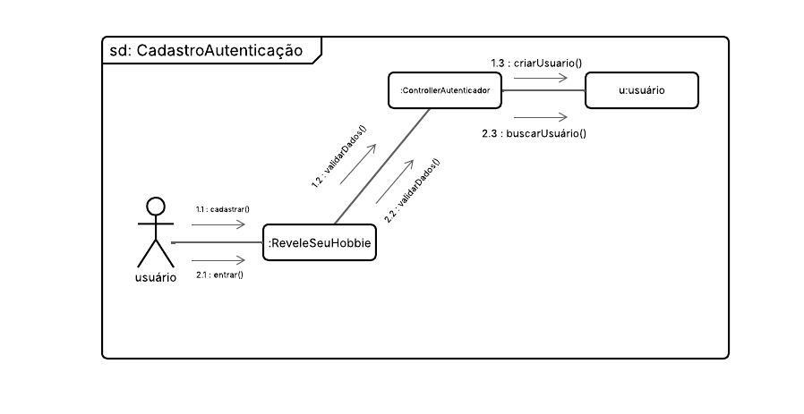
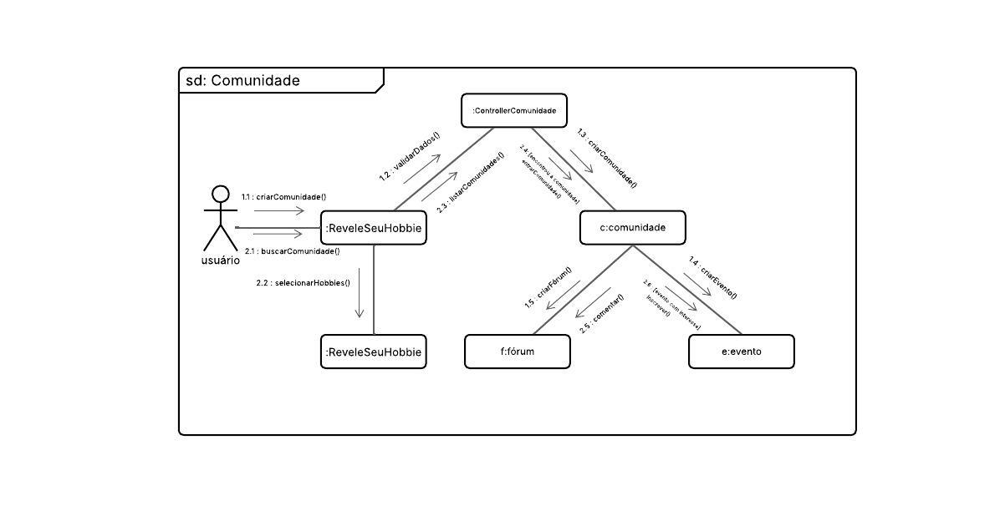
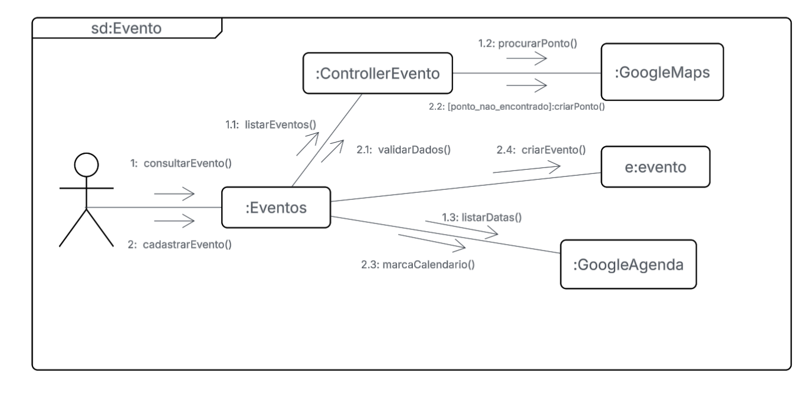

# Diagrama de Comunicação

O Diagrama de Comunicação é um modelo UML utilizado para representar a interação entre objetos ou componentes de um sistema, evidenciando a sequência e o percurso das mensagens trocadas entre eles. Seu funcionamento se assemelha ao de um fluxograma, porém com ênfase na ordem das mensagens transmitidas entre os elementos que participam de um cenário determinado (geralmente associado a um caso de uso)[[1]](#ref1) . Esse diagrama retrata objetos e seus vínculos, utilizando mensagens numeradas para representar a ordem das ações. Ele também pode abranger condições, respostas, processos paralelos e objetos ativos, ressaltando sobretudo a estrutura do sistema em vez de sua progressão no tempo.

## Metodologia

A construção dos diagramas de comunicação do _Revele Seu Hobby_ seguiu uma abordagem sistemática fundamentada na Engenharia de Software orientada a objetos e na UML. Elaborados pelos integrantes [Leonardo Barcellos](https://github.com/oyLeonardo) e [Matheus de Alcântara](https://github.com/matheusdealcantara). Foram utilizados como referência os materiais disponibilizados pela professora Milene Serrano no curso de Arquitetura e Desenho de Software, especificamente o vídeo aula "06b - VídeoAula - DSW - Modelagem - Diagrama de Comunicação" [[1]](#ref1).

Utilizou-se o software [Lucidchart](https://www.lucidchart.com/pages/pt/diagramas-de-comunicacao-uml) para a criação dos diagramas, aproveitando suas funcionalidades que facilitam a representação visual clara e organizada das interações entre os objetos, além disso, os integrantes discutiram quais fluxos seriam mais relevantes para a modelagem, optando por processos centrais do sistema como autenticação, criação e interação com comunidades e gerenciamento de eventos.

## Diagramas

Foram desenvolvidos 3 diagramas de comunicação que abordam 3 processos/interações diferentes, sendo eles o de _Autenticação_, _Comunidade_ e _Evento_, respectivamente.

## Objetos

| Objeto                    | Responsabilidade                                                                 |
| ------------------------- | -------------------------------------------------------------------------------- |
| `:ReveleSeuHobbie`        | Gerencia as ações de cadastro e login solicitadas pelo Usuário.                  |
| `:ControllerAutenticador` | Valida os dados e interage com a classe Usuário para criar ou buscar um usuário. |
| `:Usuário`                | Gerencia os dados e a lógica de negócios relacionados a entidade Usuário.        |

## Fluxo de Mensagens

### Fluxo 1

1 `Usuário → :ReveleSeuHobbie`  
**cadastrar()** – O usuário solicita o cadastro no sistema.

2 `:ReveleSeuHobbie → :ControllerAutenticador`  
**validarDados()`** – A interface principal solicita a validação dos dados de cadastro ao controlador.

3 `ControllerAutenticador → :Usuário`  
**criarUsuario()`** – Se os dados forem válidos, o controlador envia uma mensagem para a classe Usuário para criar um novo usuário.

### Fluxo 2

1 `Usuário → :ReveleSeuHobbie`  
**entrar()`** - O usuário solicita o login no sistema.

2 `ReveleSeuHobbie → :ControllerAutenticador`  
**validarDados()`** – A interface principal solicita a validação dos dados de login ao controlador.

3 `ControllerAuntenticador → :Usuário`  
**buscarUsuario()`** – Se os dados forem válidos, o controlador busca o usuario correspondente.

 
 

## 

## **Objetos**

| Objeto                  | Responsabilidade                                                                                                                                 |
| ----------------------- | ------------------------------------------------------------------------------------------------------------------------------------------------ |
| `:ReveleSeuHobbie`      | Gerencia as ações de **criação** e **busca** de comunidades e a seleção de hobbies pelo **Usuário**.                                             |
| `:ControllerComunidade` | Valida os dados e interage com as classes **`c:comunidade`**, **`f:fórum`** e **`e:evento`** para gerenciar a criação e listagem de comunidades. |
| `c:comunidade`          | Gerencia os dados e a lógica de negócio de **comunidades**.                                                                                      |
| `f:fórum`               | Gerencia a criação e lógica dos **fóruns** associados a uma comunidade.                                                                          |
| `e:evento`              | Gerencia a criação e lógica dos **eventos** associados a uma comunidade.                                                                         |

---

## **Fluxo de Mensagens**

### **Fluxo 1: Criação de Comunidade**

1 `Usuário → :ReveleSeuHobbie`  
**`criarComunidade()`** – O usuário solicita a criação de uma nova comunidade.

2 `:ReveleSeuHobbie → :ControllerComunidade`  
**`validarDados()`** – A interface principal solicita a validação dos dados de criação da comunidade ao controlador.

3 `:ControllerComunidade → c:comunidade`  
**`criarComunidade()`** – Se os dados forem válidos, o controlador envia uma mensagem para a classe **`c:comunidade`** para criar uma nova comunidade.

4 `:ControllerComunidade → f:fórum`  
**`criarFórum()`** – O controlador solicita a criação de um fórum para a nova comunidade.

5 `:ControllerComunidade → e:evento`  
**`criarEvento()`** – O controlador solicita a criação de um evento para a nova comunidade.

### **Fluxo 2: Interação com Comunidades**

1 `Usuário → :ReveleSeuHobbie`  
**`buscarComunidade()`** – O usuário busca uma comunidade no sistema.

2 `:ReveleSeuHobbie → :ControllerComunidade`  
**`listarComunidades()`** – A interface principal solicita ao controlador a listagem das comunidades.

3 `:ControllerComunidade → c:comunidade`  
**`buscarComunidades()`** – O controlador busca a lista de comunidades.

4 `:ControllerComunidade → Usuário`  
**`enviarComunidades()`** – O controlador envia a lista de comunidades encontradas de volta ao usuário.

5 `Usuário → :ReveleSeuHobbie`  
**`selecionarHobbies()`** – O usuário seleciona seus hobbies na interface principal.

6 `f:fórum → e:evento`  
**`comentar()`** – Um usuário em um fórum pode comentar em eventos.

 
 

---

## **Objetos**

| Objeto              | Responsabilidade                                                                                                                     |
| ------------------- | ------------------------------------------------------------------------------------------------------------------------------------ |
| `:Eventos`          | Gerencia a **listagem**, **consulta** e **cadastro** de eventos solicitados pelo **Usuário**.                                        |
| `:ControllerEvento` | **Valida os dados** e interage com as APIs do Google e com a classe **`e:evento`** para gerenciar a criação e interação com eventos. |
| `:GoogleMaps`       | API responsável por **procurar pontos geográficos** e, caso não encontre, **criar um novo ponto** para a localização do evento.      |
| `:GoogleAgenda`     | API responsável por **listar datas** e **marcar eventos** no calendário do usuário.                                                  |
| `e:evento`          | Gerencia os dados e a lógica de negócio dos **eventos**.                                                                             |

---

## **Fluxo de Mensagens**

### **Fluxo 1: Consultar Evento**

1 `Usuário → :Eventos`  
**`consultarEvento()`** – O usuário solicita a consulta de um evento.

2 `:Eventos → :ControllerEvento`  
**`listarEventos()`** – A interface de eventos solicita ao controlador a listagem dos eventos disponíveis.

3 `:ControllerEvento → :GoogleMaps`  
**`procurarPonto()`** – O controlador busca a localização do evento no Google Maps.

4 `:ControllerEvento → :GoogleAgenda`  
**`listarDatas()`** – O controlador busca as datas e horários disponíveis para o evento na agenda do Google.

### **Fluxo 2: Cadastrar Evento**

1 `Usuário → :Eventos`  
**`cadastrarEvento()`** – O usuário solicita o cadastro de um novo evento.

2 `:Eventos → :ControllerEvento`  
**`validarDados()`** – A interface de eventos solicita a validação dos dados de cadastro ao controlador.

3 `:ControllerEvento → :GoogleMaps`  
**`criarPonto()`** – Se a localização do evento não existir, o controlador envia uma mensagem para a API do Google Maps para criar um novo ponto geográfico.

4 `:ControllerEvento → e:evento`  
**`criarEvento()`** – O controlador envia uma mensagem para a classe **`e:evento`** para criar um novo evento.

5 `:Eventos → :GoogleAgenda`  
**`marcaCalendario()`** – Após a criação do evento, a interface envia uma mensagem para a API do Google Agenda para marcar o evento no calendário do usuário.

## Referências

[[1]](#diagrama-de-classes)
Módulo Notação UML - Modelagem Dinâmica

- 06b - VídeoAula - DSW - Modelagem - Diagrama de Comunicação. Disponível em: [[Aprender3]](https://unbbr-my.sharepoint.com/:v:/g/personal/mileneserrano_unb_br/EWMy259ZJ7tGl78GcwMtbFcB75NvMoPphK3LHZ_-5D3-8Q?e=GJyIAU). Acesso em: 19/09/2025.

## Histórico de Versões

| Data       | Versão | Descrição                                        | Autor(es)                                                                                                           | Revisor(es) | Descrição da Revisão | Data da Revisão |
| ---------- | ------ | ------------------------------------------------ | ------------------------------------------------------------------------------------------------------------------- | ----------- | -------------------- | --------------- |
| 19/09/2025 | `1.0`  | Criação do documento e elaboração dos diagramas. | [Leonardo Barcellos](https://github.com/oyLeonardo) e [Matheus de Alcântara](https://github.com/matheusdealcantara) |             |                      |                 |
