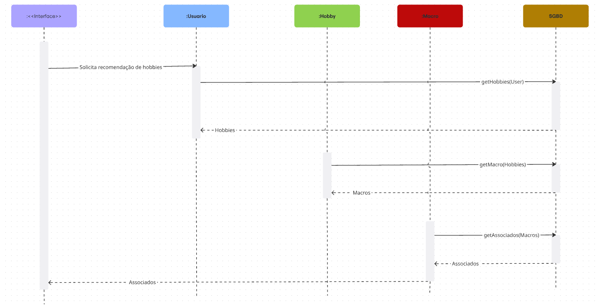
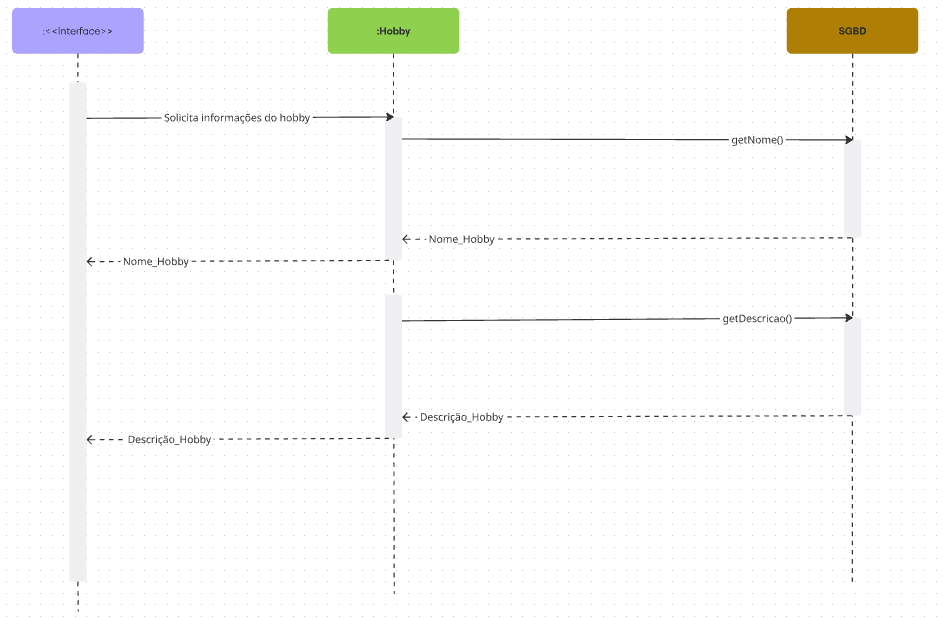
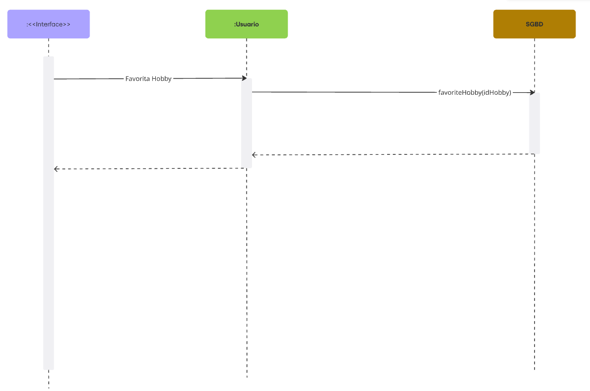
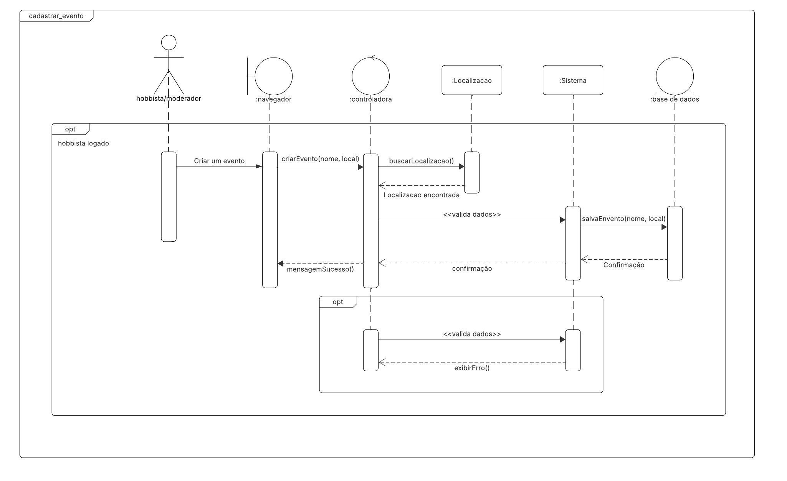
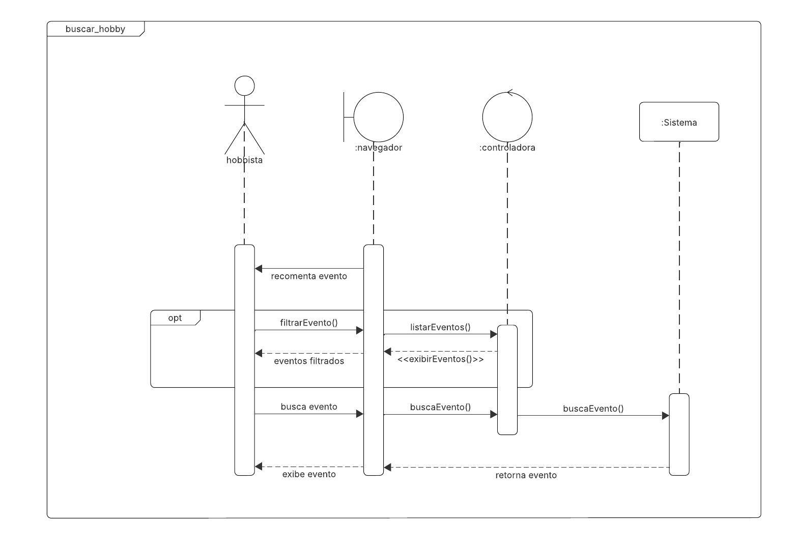

# Introdução

O diagrama de sequência é um dos diagramas de interação mais utilizados e tem como foco principal ilustrar a troca de mensagens entre diferentes componentes de um sistema, conhecidos como lifelines (linhas da vida). Ele descreve uma interação focando na sequência cronológica em que as mensagens são enviadas e recebidas, mostrando o fluxo de controle de uma operação passo a passo <a href="#ref1">[1]</a> <a href="#ref1">[3]</a> <a href="#ref1">[6]</a> <a href="#ref1">[7]</a>.

# Objetivo

O objetivo dos diagramas é fornecer um guia para a implementação de funcionalidades específicas do sistema Revele Seu Hobby. Ao especificar a ordem exata das chamadas e as mensagens trocadas entre os objetos, o diagrama ajuda a garantir que a lógica do software seja construída de forma correta e eficiente, servindo também como uma documentação clara para implementações e futuras manutenções do software <a href="#ref1">[1]</a> <a href="#ref1">[3]</a> <a href="#ref1">[6]</a> <a href="#ref1">[7]</a>.

# Metodologia 

O desenvolvimento do diagrama de sequência fundamentou-se a partir da divisão igualitária deste, ou seja, os integrantes escolheram quais fluxos iriam elaborar com base no material disponibilizado pela professora Milene Serrano <a href="#ref3">[3]</a> <a href="#ref4">[4]</a>. Além disso, a equipe consultou um site com variados diagramas de UML <a href="#ref2">[1]</a> e outro site com exemplos <a href="#ref3">[5]</a>. Para a elaboração, foram utilizadas as ferramentas: [Lucidchart](https://www.lucidchart.com/pages/pt/diagramas-de-comunicacao-uml) e [Miro](https://miro.com/app/dashboard).

A partir da conclusão dos diagramas individuas, a equipe desenvolvou a documentação, também de maneira divida, um tópico para cada.

## Integrantes Envolvidos

- [Ígor Veras Daniel](https://github.com/igorvdaniel)
- [Yzabella Pimenta](https://github.com/redjsun)

# Resultados

As figuras 1 a 5 a seguir apresentam os diagramas de sequencia criados por cada participante:

Figura 1: Diagrama de sequência de recomendar hobby

Fonte: Autoria de <a href="https://github.com/igorvdaniel">Ígor Veras</a>

Figura 2: Diagrama de sequência de Visualizar hobby

Fonte: Autoria de <a href="https://github.com/igorvdaniel">Ígor Veras</a>

Figura 3: Diagrama de sequência de favoritar hobby

Fonte: Autoria de <a href="https://github.com/igorvdaniel">Ígor Veras</a>

Figura 4: Diagrama de sequência de criar evento

Fonte: Autoria de <a href="https://github.com/redjsun">Yzabella Pimenta</a>

Figura 5: Diagrama de sequência de buscar evento

Fonte: Autoria de <a href="https://github.com/redjsun">Yzabella Pimenta</a>

# Conclusão

Ao mapear as interações para as funcionalidades, foi possível estabelecer uma ordem cronológica clara das operações e definir as responsabilidades de cada componente do sistema. Estes diagramas servirão não apenas como um roteiro para a codificação, minimizando ambiguidades e acelerando o processo de desenvolvimento, mas também como uma documentação essencial para a manutenção e evolução futura do software.

# Referência bibliográfica

<ol>
    <li id="ref1">
    UML-DIAGRAMS.ORG. Sequence Diagrams. <strong>UML Diagrams, 2025</strong>. Disponível em: <a href=https://www.uml-diagrams.org/sequence-diagrams.html>UML-Diagrams</a>. Acesso em: 19 set. 2025.
    </li>
    <li id="ref2">
    UML-DIAGRAMS. <strong>Class Diagrams Overview</strong>. 2025. Disponível em: <a href="https://www.uml-diagrams.org/class-diagrams-overview.html">UML-Diagrams</a>. Acesso em: 21 set. 2025.
    </li>
    <li id="ref3">
    SERRANO, Milene. <strong>06a - VídeoAula - DSW - Modelagem - Diagrama de Sequência</strong>. [S. l.]: Milene Serrano, 2025. Disponível em: <a href="https://unbbr-my.sharepoint.com/personal/mileneserrano_unb_br/_layouts/15/stream.aspx?id=%2Fpersonal%2Fmileneserrano_unb_br%2FDocuments%2FArqDSW%20-%20VídeosOriginais%2F06a%20-%20VideoAula%20-%20DSW-Modelagem%20-%20Sequencia%2Emp4&ga=1&referrer=StreamWebApp%2EWeb&referrerScenario=AddressBarCopied%2Eview%2Ee97f5370-64e7-4865-a430-890ae9149824">Aprender3</a>. Acesso em: 18 set. 2025.
    </li>
    <li id="ref4">
    SERRANO, Milene. <strong>AULA - MODELAGEM UML DINÂMICA</strong>. [S. l.]. 2025. Disponível em: <a href="https://aprender3.unb.br/pluginfile.php/3178388/mod_page/content/1/Arquitetura%20e%20Desenho%20de%20Software%20-%20Aula%20Modelagem%20UML%20Din%C3%A2mica%20-%20Profa.%20Milene.pdf">Aprender3</a>. Acesso em: 18 set. 2025.
    </li>
    <li id="ref5">
        CREATELY. <strong>Tutorial do Diagrama de Sequência: Guia completo com exemplos</strong>. Creately Blog, 29 jan. 2021. Disponível em: <a href="https://creately.com/blog/pt/diagrama/tutorial-do-diagrama-de-sequencia">Creately</a>. Acesso em: 21 set. 2025.
    </li> 
    <li id="ref6">
    VISUAL PARADIGM. <strong>Tudo O Que Você Precisa Saber Sobre Diagramas De Sequência</strong>. Visual Paradigm Blog, 11 fev. 2022. Disponível em: <a href="https://blog.visual-paradigm.com/pt/everything-you-need-to-know-about-sequence-diagrams">Visual Paradigm</a>. Acesso em: 21 set. 2025.
    </li>
    <li id="ref7">
    LUCIDCHART. <strong>O que é Diagrama de Sequência UML</strong>. 2025. Disponível em: <a  href="https://www.lucidchart.com/pages/pt/o-que-e-diagrama-de-sequencia-uml">Lucidchart</a>. Acesso em: 21 set. 2025.
    </li>
</ol>

 

# Histórico de Versões

| Versão | Data       | Descrição                    | Autor(es)        | Revisor(es)         | Comentários | Data da revisão |
|--------|------------|------------------------------|------------------|---------------------|---------------------|---------------------|  
| `1.0` |  21/09    | Criação do documento | [Ígor Veras Daniel](https://github.com/igorvdaniel) e [Yzabella Pimenta](https://github.com/redjsun) |  N/A   | N/A   |  N/A |
| `1.0` |  21/09    | Adição de metodologia, referências e diagrmas de criar e buscar evento. | [Yzabella Pimenta](https://github.com/redjsun) |   [Ana Luiza Soares](https://github.com/Ana-Luiza-SC) |  Foi ajustado pequenos erros de português, mas de resto o documento está consistente e correto |  21/09/2025  |
