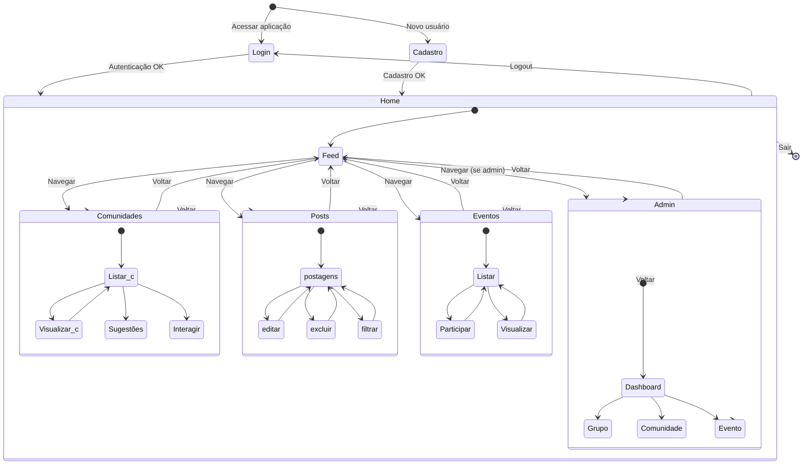

# Diagrama UML de Estados - Revele Seu Hobbie

## Introdução

O diagrama de estados UML representa o comportamento de um sistema através dos diferentes estados que ele pode assumir e as transições entre esses estados. Para a aplicação foi modelado o fluxo de navegação e interação do usuário com o sistema, desde o acesso inicial até as funcionalidades principais.

## Metodologia

A criação do diagrama de estados foi baseada na análise dos protótipos desenvolvidos pela equipe na primeira entrega, identificando os principais estados do sistema e modelando o diagrama através da plataforma Mermaid, que pode ser acessado pelo [link](https://www.mermaidchart.com/app/projects/0c66e4cf-8fd3-44c4-a270-70529e43d6ef/diagrams/c4bc43b1-6f5b-4e4c-aa3f-ae1b913f4d38/version/v0.1/edit)

## Diagrama de Estados

## Descrição dos Estados e Transições

### Estados Principais

#### Login/Cadastro
- **Função**: Autenticação e registro de usuários
- **Transições**: Ambos levam ao estado `Home` após sucesso

#### Home
- **Função**: Hub central de navegação
- **Subestados**: Feed principal com navegação para módulos
- **Controle**: Acesso ao Admin restrito a usuários autorizados

#### Comunidades
- **Função**: Gerenciamento de comunidades de hobbies
- **Subestados**: Listar → Criar/Visualizar/sugestões → Retorno

#### Posts
- **Função**: Gerenciamento de posts dos usuários
- **Subestados**: Listar → Excluir/Editar/Filtrar → Retorno

#### Eventos
- **Função**: Gerenciamento de eventos
- **Subestados**: Listar → Participar/Visualizar → Retorno

#### Admin
- **Função**: Administração do sistema
- **Subestados**: Dashboard → Grupos/Comunidades/Eventos

## Conclusão

O diagrama de estados modela o comportamento essencial da aplicação. A estrutura hierárquica com estados compostos facilita o entendimento dos fluxos principais de navegação, autenticação e funcionalidades, servindo como base clara para implementação e testes do sistema.

## Histórico de Versões

| Versão | Data | Descrição | Autor | Revisor | Comentário do revisor |
|--------|------|-----------|-------|---------|-----------------------|
| 1.0 | 19/09 | Criação do documento e primeira versão do diagrama de estados| [Ruan Carvalho](https://github.com/Ruan-Carvalho) |  |  |  |