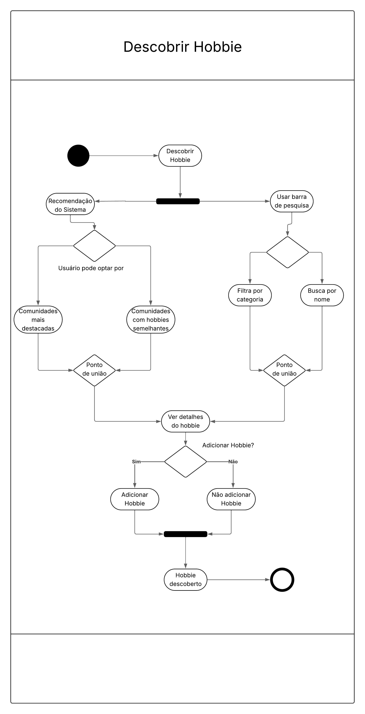
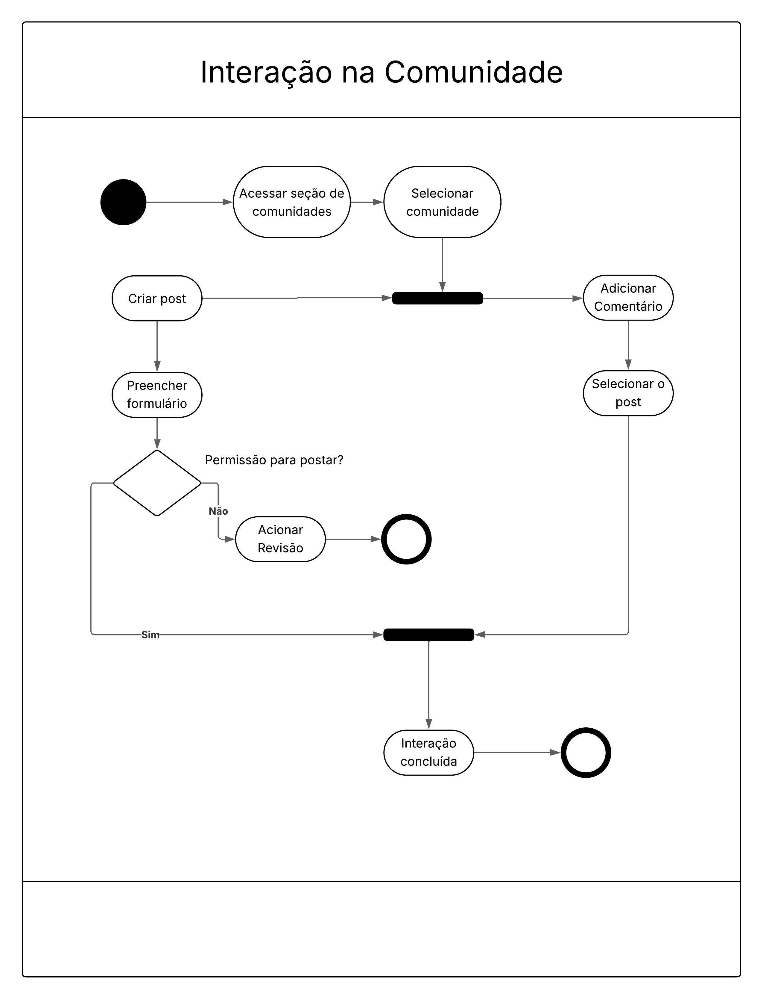
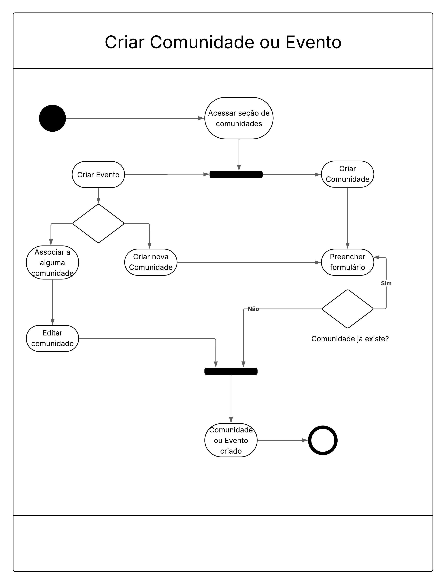
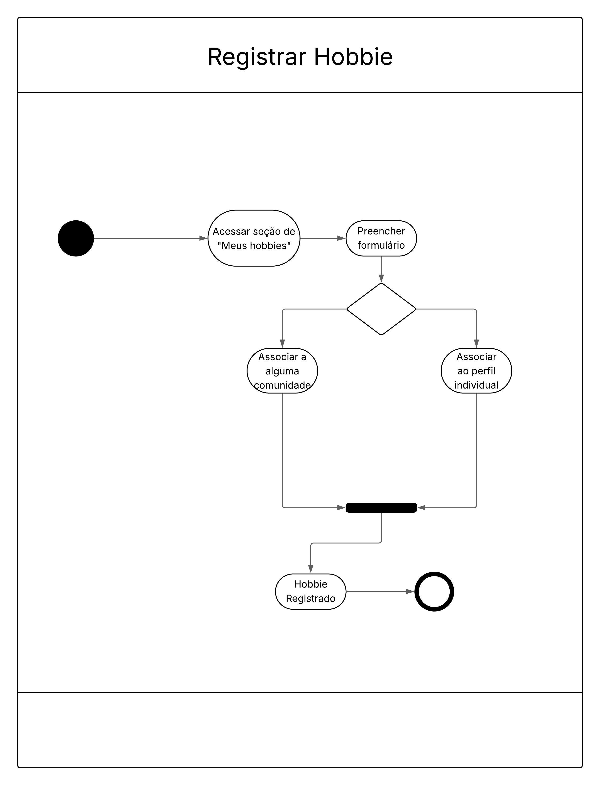

# Diagrama UML de Atividades

O Diagrama de Atividades é uma das ferramentas da UML (Linguagem de Modelagem Unificada) usada para representar os fluxos de trabalho de um sistema. Pense nele como um fluxograma avançado que mostra o fluxo de controle de uma atividade para outra.

Seu principal objetivo é descrever a dinâmica do sistema, modelando passo a passo as ações que acontecem, as decisões que são tomadas e como diferentes caminhos se unem ou se dividem.

## Metodologia

A criação dos Diagramas de Atividades para esta documentação seguiu um processo estruturado para garantir que esteja dentro do escopo de entrega mínima e com a intenção de seguir a notação UML. A criação consistiu na análise dos vídeos postados na plataforma do `aprender` e também os os slides apresentando em sala de aula.

A metodologia para confecção do diagrama foi dividida nas seguintes etapas:

1. **Definição do Escopo e Objetivo**: Antes de iniciar a modelagem, foram decididas quais atividades seriam mapeadas, estabelecendo assim o escopo do diagrama (no caso decidimos 4 atividades principais que compõem a aplicação), identificando o ponto de início (Nó Inicial) e os possíveis pontos de término (Nó Final) das seguintes atividades:
  - `Descobrir Hobbie`
  - `Interação na Comunidade`
  - `Criar Comunidade ou Evento`
  - `Registrar Hobbie`
2. **Ferramenta de Modelagem**: Como utilizada em entregas passadas, decidimos utilizar o [Lucidcart](https://www.lucidchart.com/pages), pois já haviamos feito um BPMN anteriormente a reaproveitamos o template 
3. **Mapeamento dos Fluxos**: A construção de cada diagrama começou com o mapeamento do fluxo padrão de resposta, que representa a sequência de eventos mais comum e bem-sucedida, considerando outros caminhos paralelos
4. **Aplicação da Notação UML**: Tentamos ao máximo seguir os padrões de UML para a confecção do diagrama.
5. **Documentação e Validação**: Por fim, cada diagrama foi acompanhado de uma Descrição do Fluxo, explicando passo a passo e sendo validada por revisores da documentação

## Principais Componentes Utilizados

- **Nó Inicial (Círculo Preto)**: Marca o início do fluxo.
- **Ação (Retângulo com Bordas Arredondadas)**: Representa uma tarefa ou passo a ser executado.
- **Nó de Decisão (Losango)**: Um ponto onde o caminho se divide com base em uma condição (ex: "Sim/Não"). Apenas um caminho é seguido.
- **Barra de Bifurcação/Fork (Linha Preta Grossa)**: Divide um único fluxo em múltiplos fluxos que podem ocorrer em paralelo (ao mesmo tempo).
- **Barra de Junção/Join (Linha Preta Grossa)**: Sincroniza múltiplos fluxos paralelos de volta para um único fluxo.
- **Nó Final (Círculo Preto com uma Borda)**: Marca o fim do fluxo.

## Documentação dos diagramas

Abaixo contém a documentação e a realização dos seguintes diagramas de atividades da aplicação:

### Descobrir Hobbie

  

**Objetivo:** Este diagrama modela o processo pelo qual um usuário encontra novos hobbies na plataforma, seja através de recomendações automáticas do sistema ou por meio de uma busca manual.

#### Descrição do Fluxo

1. O fluxo se inicia quando o usuário decide Descobrir um Hobbie.
2. O sistema oferece duas maneiras paralelas (Fork) para a descoberta:
    - Caminho A: Recomendação do Sistema: O usuário recebe sugestões baseadas em seu perfil e pode optar por ver "Comunidades com hobbies semelhantes" ou "Comunicações mais destacadas".
    - Caminho B: Usar Barra de Pesquisa: O usuário pode buscar ativamente por um hobby, seja "Filtrando por categoria" ou fazendo uma "Busca por nome".
3. Ambos os caminhos levam o usuário a uma lista de hobbies. Ao escolher um, o usuário pode Ver detalhes do hobbie.
4. Após ver os detalhes, o usuário toma uma Decisão: "Adicionar Hobbie?".
5. Se "Sim", a ação "Adicionar Hobbie" é executada, associando o hobby ao perfil do usuário.
6. Se "Não", nenhuma ação de adição é tomada.
7. Ambos os resultados da decisão convergem, e o fluxo termina com o estado Hobbie descoberto.

### Interação na Comunidade

  

**Objetivo:** Descrever como um usuário interage dentro de uma comunidade específica, focando nas ações de criar uma nova postagem ou adicionar um comentário a uma postagem existente.

#### Descrição do Fluxo

1. O fluxo começa quando o usuário Acessa a seção de comunidades e, em seguida, Seleciona uma comunidade específica.
2. A partir daí, o usuário tem duas opções que podem ser pensadas em paralelo (Fork): "Criar post" ou "Adicionar Comentário".
    - Caminho A: Criar post:
        1. O usuário Preenche o formulário da nova postagem.

        2. O sistema verifica se o usuário tem Permissão para postar?.

        3. Se "Não", o sistema pode Acionar uma Revisão (por um moderador, por exemplo) e o fluxo do usuário termina.

        4. Se "Sim", o fluxo continua.

    - Caminho B: Adicionar Comentário:

        1. O usuário primeiro precisa Selecionar o post ao qual deseja responder.

        2. (Ação implícita: o usuário escreve e envia o comentário).

3. Após a postagem ser criada com sucesso ou o comentário ser adicionado, os fluxos se unem (Join).
4. O processo é finalizado com o estado Interação concluída.

### Criar Comunidade ou Evento

  

**Objetivo:** Modelar o fluxo de criação de uma nova comunidade ou de um novo evento pelo usuário.

#### Descrição do Fluxo

1. O processo se inicia com o usuário acessando a Seção de comunidades.
2. O fluxo se divide (Fork), permitindo ao usuário escolher entre "Criar Evento" e "Criar Comunidade".

    - Caminho A: Criar Evento:

        1. O usuário decide se irá Associar a alguma comunidade existente ou Criar nova Comunidade.

        2. Se associar, o fluxo leva a uma ação de "Editar comunidade".

    - Caminho B: Criar Comunidade:

        1. O usuário Preenche o formulário de criação.

        2. O sistema verifica se a Comunidade já existe?. Independentemente da resposta ("Sim" ou "Não"), os caminhos se unem e continuam.

3. Os fluxos se reagrupam (Join) e o processo termina com o status Comunidade ou Evento criado.

### Registrar Hobbie

  

**Objetivo:** Ilustrar o processo de um usuário adicionar um novo hobby em seu perfil, seja associando-o a uma comunidade ou apenas ao seu perfil individual.

#### Descrição do Fluxo:

1. O fluxo se inicia quando o usuário Acessa a seção de "Meus hobbies".

2. A seguir, ele Preenche um formulário com as informações do hobby.

3. Ocorre uma Decisão (implícita): o hobby será associado a uma comunidade ou apenas ao perfil?

    - Caminho A: O usuário escolhe Associar a alguma comunidade.

    - Caminho B: O usuário escolhe Associar ao perfil individual.

4. Ambos os caminhos levam à mesma conclusão, unindo-se em uma Barra de Junção (Join).

5. O processo é concluído com o status Hobbie Registrado.

## Histórico de Versões

| Versão | Data       | Descrição                       | Autor(es)               | Revisor(es)          | Data de Revisão |
|--------|------------|---------------------------------|------------------------|----------------------|-----------------|
| `1.0`  | 16/09/2025 | Criação do documento e adicionando novos conteúdos dos diagramas de atividades           | [Paulo Lamounier](https://github.com/Nanashii76) e [Natan Almeida](https://github.com/natanalmeida03)   |     |      |
| `1.1`| 21/09/2025 | Adicionando metodologia na documentação |   |   |