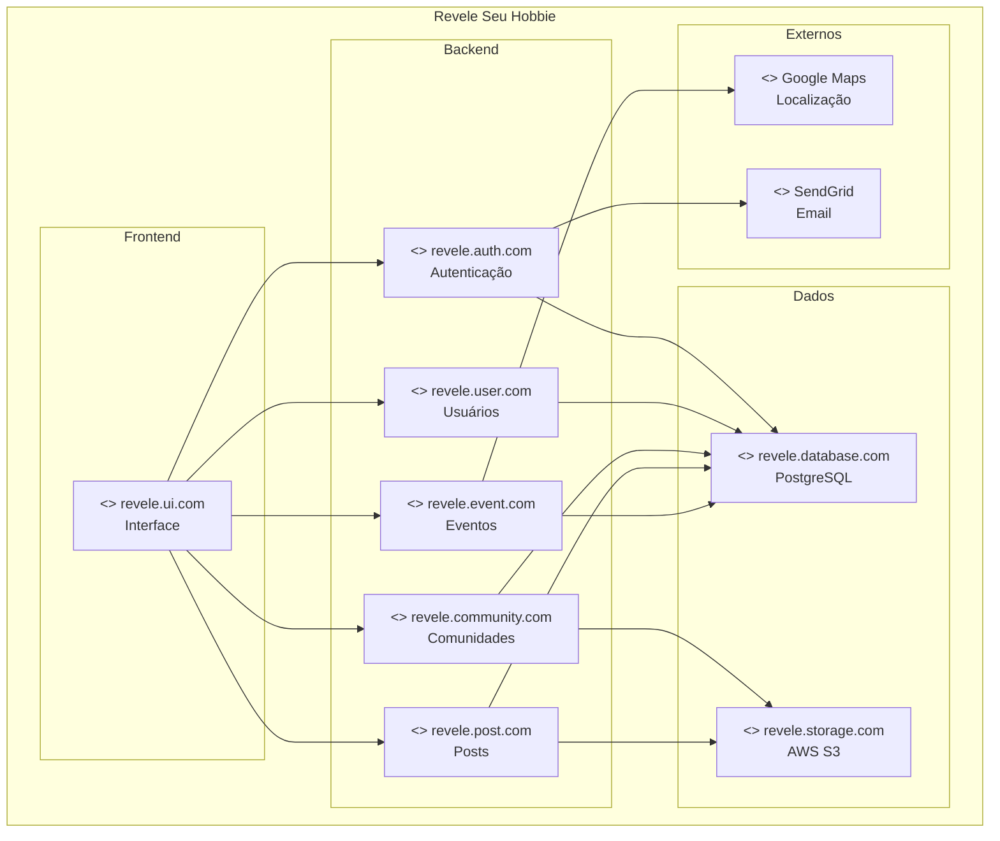
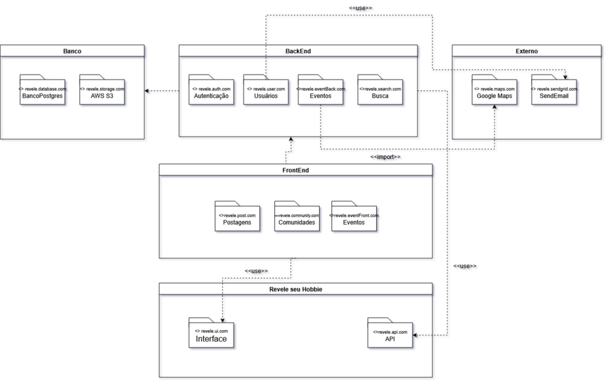

# Diagrama UML de Pacotes

Diagramas de pacotes são diagramas estruturais usados para mostrar, em uma forma de pacotes, a organização e disposição de vários elementos de modelos. Um pacote é um agrupamento de elementos UML relacionados, como diagramas, documentos, classes ou até mesmo outros pacotes.

## Metodologia

A ideial inicial foi modelar o diagrama usando o [Mermaid](https://www.mermaidchart.com/app/projects/0c66e4cf-8fd3-44c4-a270-70529e43d6ef/diagrams/119979bd-782f-4cd7-90b1-6bde08b9d8f8/version/v0.1/edit) e extrair as ideias principais para o UML, utilizando como base o material exemplo da professora e seguindo as instruções do site [UML Diagrams](https://www.uml-diagrams.org/package-diagrams-overview.html)

## Diagrama de Pacotes

A arquitetura da aplicação "Revele seu Hobbie" foi projetada de forma modular, dividida em cinco pacotes principais que representam as camadas lógicas do sistema: Revele seu Hobbie (a camada de aplicação), FrontEnd, BackEnd, Banco (persistência) e Externo (serviços de terceiros). Este design promove uma clara separação de conceitos, facilitando a manutenção e a escalabilidade do projeto.

<figcaption>Figura 1: Diagrama de pacotes</figcaption>

## Componentes

### Banco

- O pacote `< > BancoPostgres (revele.database.com)` : Armazena os dados da aplicação.

- O pacote `< > AWS S3 (revele.storage.com)`: Armazena arquivos e conteúdos como imagens e vídeos.

### Backend

- O pacote `< > revele.auth.com (Autenticação)`: Gerencia a segurança, login, cadastro e validação de usuários

- O pacote `< > revele.user.com (Usuários)`: Responsável pelo gerenciamento dos dados dos perfis de usuário

- O pacote `< > revele.eventBack.com (Eventos)`: Contém a lógica de servidor para criar, gerenciar e buscar eventos

- O pacote `< > revele.search.com (Busca)`: Centraliza a funcionalidade de pesquisa da plataforma

### Frontend

- O pacote `< > revele.post.com (Postagens)`: Contém todos os componentes visuais e a lógica de interface relacionados à criação e visualização de posts (hobbies)

- O pacote `< > revele.community.com (Comunidades)`: Responsável pela interface de criação, gerenciamento e participação em comunidades.

- O pacote `< > revele.eventFront.com (Eventos)`: Contém os componentes de UI para a funcionalidade de eventos, como formulários de criação e telas de visualização

### Externo

- O pacote `< > revele.maps.com (Google Maps)`: Fornece funcionalidades de geolocalização e mapas para os eventos presenciais

- O pacote `< > revele.sendgrid.com (SendEmail)`: Responsável pelo envio de e-mails transacionais, como confirmação de cadastro e notificações

## Histórico de versões

| Versão | Data       | Descrição                                        | Autor(es)           | Revisor(es)         | Comentários dos revisores |
|--------|------------|--------------------------------------------------|---------------------|---------------------|---------------------------|
| `1.0 ` | 20/09      | Criação do documento | [Natan Almeida](https://github.com/natanalmeida03), [Paulo Henrique L. Dantas](https://github.com/Nanashii76), [Ruan Sobreira Carvalho](https://github.com/Ruan-Carvalho), [Leonardo Barcellos](https://github.com/oyLeonardo) e [Arthur Augusto Rezende da Paixão](https://github.com/arthur-augusto)|  |  |