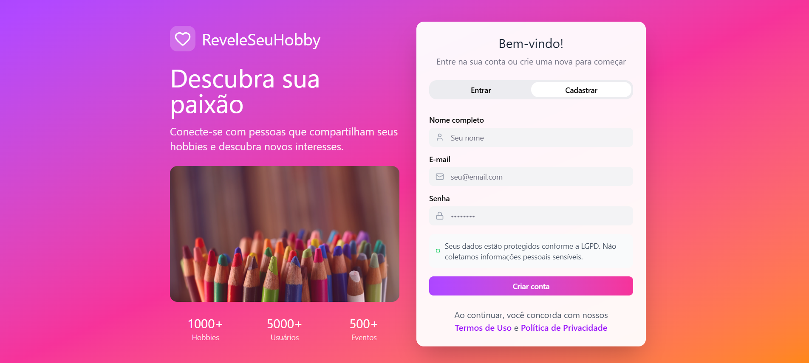

# 4.1 Prototipação 2.0

## Introdução

O protótipo é um artefato muito importante para a produção de um sistema de software, ele permite que o usuário avalie previamente se a interface do sistema sana as suas necessidades e desejos. 

O protótipo também é muito importante pois de acordo com [Leinonen e Roto (2023)](#ref-02), o protótipo comunica a equipe de desenvolvimento as funcionalidades do serviço que será implementado e ele pode ser processado também pelo backlog do produto (ou do termo em inglês, o *Product Backlog*).

Ademais, [Leinonen e Roto (2023)](#ref-02) também citam que o protótipo é uma das ferramentas de grande importância para uma melhor transferência de conhecimento e do processo ágil da experiência de usuário (do termo inglês *User Experience \- UX*).

Portanto, a equipe do projeto Revele Seu Hobby decidiu que era de suma importância que o protótipo fosse refatorado uma vez que ele é um artefato de grande importância para o desenvolvimento do projeto e para uma melhor transferência de conhecimento entre as entregas, de forma que não gerasse inconsistência e mantivesse a visão inicial do produto durante a primeira entrega.

## Metodologia

De acordo com [Stickdorn et al. (2019)](#ref-03), a prototipação, ato de gerar protótipo, é um processo estruturado e interativo que cria o protótipo.

Além disso, atualmente com a crescente onda de aprimoramento de inteligência artificial (IA), as plataformas vêm buscando cada vez mais desenvolvimento de recursos integrados com IAs que otimizem os tempos de seus usuários. Não só isso, mas também no mundo corporativo as empresas vêm investindo cada vez mais em IAs, uma vez que ganhos das empresas obtidos são incrementais, refletindo-se, por exemplo, em mais eficiência e na otimização de processo ([DINO, 2025](#ref-01)).

Neste contexto, no dia 16 de setembro de 2025, os alunos [Ana Luiza](https://github.com/Ana-Luiza-SC) e [Matheus de Alcântara](https://github.com/matheusdealcantara) se reuniram para refatorar o protótipo, no entanto, ao entrar na plataforma do [Figma](https://www.figma.com), plataforma comumente usada para o desenvolvimento de protótipos, eles se depararam com a nova funcionalidade, o Figma Make ( para melhor compreensão, acessar a [documentação](https://help.figma.com/hc/en-us/articles/31304412302231-Explore-Figma-Make)), uma ferramenta de IA que, ao descrever de forma completa e descritiva qual é o objetivo da interface que quer ser desenvolvida, ele gera um protótipo de alta fidelidade. Com isso, os alunos concordaram que seria uma ótima oportunidade para testar essa nova ferramenta que, no futuro, poderá ser amplamente utilizada pelo mercado de trabalho.

Apesar de precisar de mais alguns comandos, o protótipo gerado foi de qualidade tão grande que ambos os alunos acharam melhor utilizar o protótipo, uma vez que além de economizar tempo, o protótipo gerado condizia com os objetivos esperados pelo grupo.

Foram utilizados os comandos:


``` 
Cria um design para um aplicativo web e mobile chamado "Revele Seu Hobby. A ideia é conectar pessoas com base nos hobbies que elas têm em comum. O app precisa ser moderno, intuitivo e responsivo. Ele deve focar em ajudar as pessoas a descobrirem novos hobbies, entrarem em comunidades, organizarem eventos, compartilharem o que estão fazendo e discutir em fóruns. A usabilidade, a conexão entre as pessoas e a segurança são as prioridades.

​O público principal são jovens e adultos que gostam de praticar hobbies, conhecer gente nova e participar de eventos. O visual deve ser minimalista e moderno, com cores vivas que lembrem criatividade e lazer. Pense em algo que combine a organização do Meetup, a comunidade do Discord e a dinâmica de posts do Instagram. Ícones e a tipografia devem ser limpos, e a navegação, super clara.

​As telas obrigatórias são:  
​A de Login e Cadastro, que precisa ser segura, com cadastro por e-mail e mensagens claras sobre a proteção dos dados.

​A de Perfil, onde o usuário pode colocar foto, uma bio, a lista dos hobbies, ver quem ele segue e quem o segue. Deve ter botões para editar o perfil e uma opção de privacidade (público ou privado).  
​A de Exploração de Hobbies, que sugere hobbies personalizados, e permite que o usuário adicione os seus e filtre por categorias (criativos, esportivos, lazer).

​A de Comunidades, que mostra grupos por hobby. A pessoa pode entrar, sair, postar, criar eventos e ver os membros. Dê um destaque visual para as comunidades mais ativas.

​A de Eventos, que exibe os eventos em um mapa (tipo Google Maps). Deve mostrar detalhes como nome, local, data, categoria e descrição, e ter botões para se inscrever, cancelar inscrição e pedir para entrar em eventos privados. É importante ter um histórico de eventos participados e a opção de avaliar depois.

​A de Fórum, que deve ser limpa e fácil de ler, com discussões organizadas por hobby ou comunidade, e a opção de criar tópicos e comentar.

​A de Publicações, onde as pessoas podem postar texto, fotos ou links dentro das comunidades, e ter as funções básicas de criar, editar, excluir, comentar e curtir.

​A de Notificações, com alertas sobre novos hobbies, eventos próximos e lembretes para praticar os hobbies.  
​E a de Configurações, para gerenciar a privacidade, segurança e denunciar outros usuários.

​Algumas regras de negócio: não pode haver recadastro para usuários banidos. Apenas contas com mais de 2 meses, menos de duas denúncias e que já participaram de 3 eventos podem criar eventos. O sistema precisa recomendar coisas com base em perfis parecidos.

​O design tem que ser intuitivo, rápido e funcionar bem em qualquer aparelho (desktop, tablet, mobile). Ele precisa ser acessível, com contraste bom, textos alternativos e navegação por teclado. As telas também devem passar confiança em relação à proteção dos dados.

​Crie um protótipo navegável com essas telas. O estilo deve ser moderno, minimalista e responsivo, e o design precisa deixar claro que a intenção é conectar pessoas de forma amigável e envolvente através dos hobbies.  
```

O protótipo final gerado pelo Figma Make se encontra neste [link](https://axis-funnel-60515536.figma.site/) e algumas telas foram colocadas no Figma Design, disponível neste [link](https://www.figma.com/design/vu5jGGP0SZ4f7RWdenZ5uN/ReveleSeuHobby?node-id=0-1&t=0UcXux5pZMT5FOpo-1), a fim de que, se necessário, futuramente seja mais fácil refatorar o protótipo antes da implementação.

## Protótipo

O protótipo gerado pode ser visto tanto nos link do [Figma Make](https://axis-funnel-60515536.figma.site/), que permite uma melhor visualização do protótipo, como no link pro [Figma Design](https://www.figma.com/design/vu5jGGP0SZ4f7RWdenZ5uN/ReveleSeuHobby?node-id=0-1&t=0UcXux5pZMT5FOpo-1) do protótipo, além disso segue abaixo as imagens 1 a 11 que mostram as telas dos protótipos.

<div style="text-align: center;">

<p>Imagem 1 - Tela Login</p>


<p> <a href="https://github.com/Ana-Luiza-SC">Ana Luiza Soares</a> e <a href="https://github.com/matheusdealcantara">Matheus de Alcântara</a></p>

</div>

---

<div style="text-align: center;">

<p>Imagem 2 - Tela de Cadastro</p>



<p> <a href="https://github.com/Ana-Luiza-SC">Ana Luiza Soares</a> e <a href="https://github.com/matheusdealcantara">Matheus de Alcântara</a></p>

</div>

---

<div style="text-align: center;">

<p>Imagem 3 - Tela Inicial</p>


<p> <a href="https://github.com/Ana-Luiza-SC">Ana Luiza Soares</a> e <a href="https://github.com/matheusdealcantara">Matheus de Alcântara</a></p>

</div>

---

<div style="text-align: center;">

<p>Imagem 4 - Tela de Perfil</p>


<p> <a href="https://github.com/Ana-Luiza-SC">Ana Luiza Soares</a> e <a href="https://github.com/matheusdealcantara">Matheus de Alcântara</a></p>

</div>

---

<div style="text-align: center;">

<p>Imagem 5 - Tela Hobbies</p>


<p> <a href="https://github.com/Ana-Luiza-SC">Ana Luiza Soares</a> e <a href="https://github.com/matheusdealcantara">Matheus de Alcântara</a></p>

</div>

---

<div style="text-align: center;">

<p>Imagem 6 - Tela Comunidades</p>


<p> <a href="https://github.com/Ana-Luiza-SC">Ana Luiza Soares</a> e <a href="https://github.com/matheusdealcantara">Matheus de Alcântara</a></p>

</div>

---

<div style="text-align: center;">

<p>Imagem 7 - Tela Eventos</p>


<p> <a href="https://github.com/Ana-Luiza-SC">Ana Luiza Soares</a> e <a href="https://github.com/matheusdealcantara">Matheus de Alcântara</a></p>

</div>

---

<div style="text-align: center;">

<p>Imagem 8 - Tela Fórum</p>


<p> <a href="https://github.com/Ana-Luiza-SC">Ana Luiza Soares</a> e <a href="https://github.com/matheusdealcantara">Matheus de Alcântara</a></p>

</div>

---

<div style="text-align: center;">

<p>Imagem 9 - Tela Publicações</p>


<p> <a href="https://github.com/Ana-Luiza-SC">Ana Luiza Soares</a> e <a href="https://github.com/matheusdealcantara">Matheus de Alcântara</a></p>

</div>

---

<div style="text-align: center;">

<p>Imagem 10 - Tela Notificações</p>


<p> <a href="https://github.com/Ana-Luiza-SC">Ana Luiza Soares</a> e <a href="https://github.com/matheusdealcantara">Matheus de Alcântara</a></p>

</div>

---

<div style="text-align: center;">

<p>Imagem 11 - Tela Configurações</p>


<p> <a href="https://github.com/Ana-Luiza-SC">Ana Luiza Soares</a> e <a href="https://github.com/matheusdealcantara">Matheus de Alcântara</a></p>

</div>

---

**Observação:** 
- Nem todos as telas que foram geradas estão nas fotos pois seriam muitas fotos, ambos integrantes acharam melhor disponibilizar a visão principal dos produtos para não gerar uma documentação muito robusta, para visualização completa do artefato é recomendado acessar o link do Figma Make disponibilizado antes das fotos.
- O artefato anterior se encontra no seguinte link: [https://unbarqdsw2025-2-turma01.github.io/2025.2-T01-G3_ReveleSeuHobbie_Entrega_01/#/Base/1.1.Prototipacao](https://unbarqdsw2025-2-turma01.github.io/2025.2-T01-G3_ReveleSeuHobbie_Entrega_01/#/Base/1.1.Prototipacao)

## Referência bibliográfica

<p>
<a id="ref-01">[01]</a>
  DINO. <strong>95% das empresas relatam aumento de receita com IA</strong>. Disponível em: &lt;<a href="https://valor.globo.com/patrocinado/dino/noticia/2025/08/25/95-das-empresas-relatam-aumento-de-receita-com-ia-1.ghtml" target="_blank">https://valor.globo.com/patrocinado/dino/noticia/2025/08/25/95-das-empresas-relatam-aumento-de-receita-com-ia-1.ghtml</a>&gt;. Acesso em: 19 set. 2025.
</p> 
<p>
<a id="ref-02">[02]</a>
&nbsp; LEINONEN, Aarne; ROTO, Virpi. <strong>Service Design Handover to user experience design – a systematic literature review</strong>, 2023. Disponível em: &lt;<a href="https://doi.org/10.1016/j.infsof.2022.107087" target="_blank">https://doi.org/10.1016/j.infsof.2022.107087</a>&gt;. Acesso em: 19 set. 2025.
</p>
<p>
<a id="ref-03">[03]</a>
&nbsp; STICKDORN, Marc; LAWRENCE, Adam; HORMESS, Markus; et al. <strong>Isto é design de serviço na prática: como aplicar o design de serviço no mundo real: manual do praticante</strong>. Porto Alegre: Bookman, 2019. E-book. p.Capa. ISBN 9788582605288. Disponível em: &lt;<a href="https://app.minhabiblioteca.com.br/reader/books/9788582605288/" target="_blank">https://app.minhabiblioteca.com.br/reader/books/9788582605288/</a>&gt;. Acesso em: 19 set. 2025.
</p>

## Histórico de versionamento

| Versão | Data       | Descrição                                        | Autor(es)           | Revisor(es)         | Comentário do revisor | Data da revisão |
|--------|------------|--------------------------------------------------|---------------------|---------------------|----------------------|-----------|
| `1.0` |  04/09/2025 | Criação do documento | [Leonardo Barcellos](https://github.com/oyLeonardo) | [Ruan Carvalho](https://github.com/Ruan-Carvalho) | (Não havia comentários nos históricos de versão da entrega 01) | (Não havia data da revisão nos históricos de versão da entrega 01) |
| `2.0` | 16/09/2025 | Refatoramento do protótipo para uma melhor qualidade  | [Ana Luiza](https://github.com/Ana-Luiza-SC) e [Matheus de Alcântara](https://github.com/matheusdealcantara)  | [Yzabella](https://github.com/redjsun)  |  (Não havia comentários nos históricos de versão da entrega 01) | (Não havia data da revisão nos históricos de versão da entrega 01) |
| `2.1` | 19/09/2025 | Documentação do protótipo, incluindo introdução, metodologia, referências bibliográficas e links  | [Ana Luiza](https://github.com/Ana-Luiza-SC) e [Matheus de Alcântara](https://github.com/matheusdealcantara)  | [Yzabella Pimenta](https://github.com/redjsun)  | Documentação aparentemente está correta, seja com os dados exibidos, ou então com as concordâncias da língua portuguesa. Não possuo nada a acrescentar a este belo trabalho. | 21/09/25 |
| `2.2` | 19/09/2025 | Adicionando imagem | [Ana Luiza](https://github.com/Ana-Luiza-SC) e [Matheus de Alcântara](https://github.com/matheusdealcantara)  | [Yzabella Pimenta](https://github.com/redjsun) | | visulizei a imagem.  | 21/09/25 |


