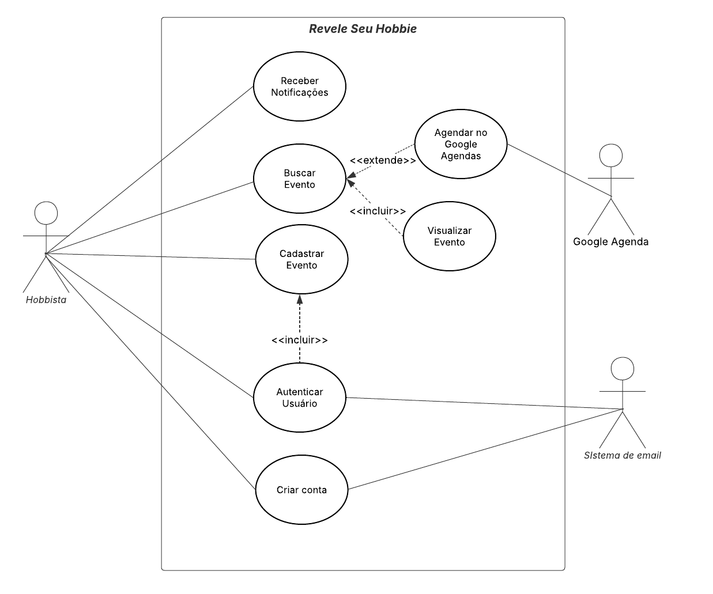
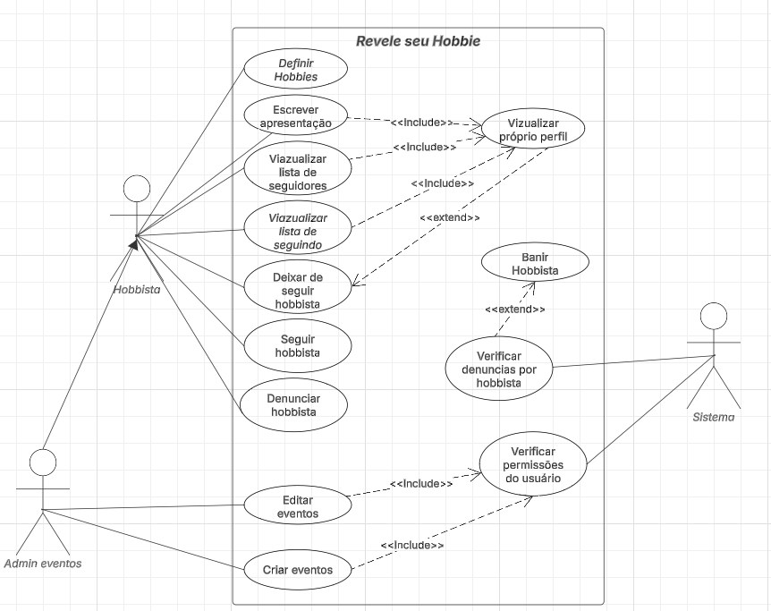
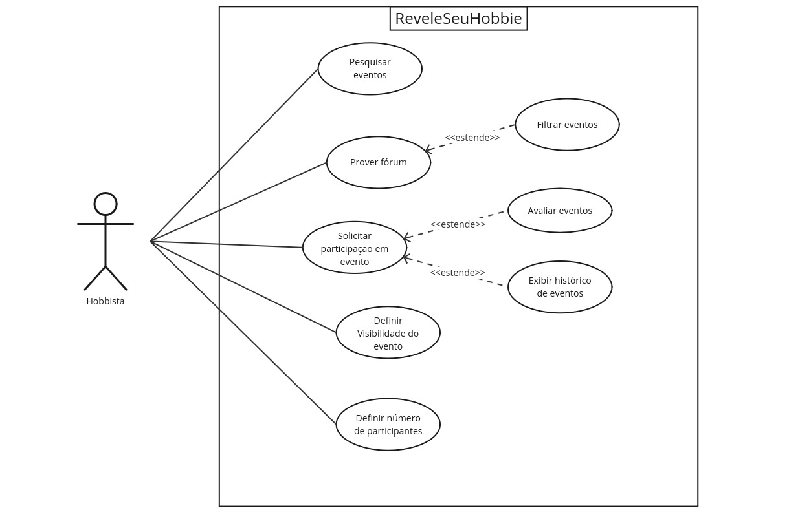

## 1. Introdução

O Diagrama de Casos de Uso é uma ferramenta da UML (Unified Modeling Language) utilizada para representar as funcionalidades de um sistema do ponto de vista do usuário. Ele captura os requisitos funcionais, mostrando quem (atores) pode fazer o quê (casos de uso) no sistema [2].

Os casos de uso são uma técnica de modelagem que representa uma sequência de interações entre um sistema e um ator(es) externo, culminando em um resultado valioso para o ator. Os nomes dos casos de uso devem ser sempre estruturados como um verbo seguido de um objeto. É importante selecionar nomes fortes e descritivos para deixar evidente, pelo nome, que o caso de uso entregará algo valioso para algum usuário [1].

Este documento tem como finalidade modelar e documentar essas interações para o sistema "Revele Seu Hobbie", proporcionando uma visão de alto nível do escopo e dos objetivos do software.

## 2. Objetivo

O principal objetivo deste documento é definir e visualizar as funcionalidades do sistema, servindo como uma ponte de comunicação entre as partes interessadas (stakeholders), a equipe de desenvolvimento e os analistas. Os objetivos específicos são:

* **Identificar os Atores:** Definir quem ou o que irá interagir com o sistema [2].
* **Definir os Casos de Uso:** Descrever as ações e objetivos que os atores podem realizar [2].
* **Visualizar Interações:** Apresentar de forma clara como os atores utilizam o sistema para alcançar seus objetivos [2].
* **Estabelecer o Escopo:** Servir como base para o planejamento do desenvolvimento, testes e validação dos requisitos [2].

## 3. Metodologia

Para a criação do diagrama, foi utilizada a notação padrão da UML. A metodologia consistiu nos seguintes passos:

1.  **Análise de Requisitos:** Extração das funcionalidades a partir da lista de requisitos fornecida [2].
2.  **Identificação de Atores:** Definição das entidades que interagem com o sistema [2].
3.  **Identificação de Casos de Uso:** Mapeamento dos requisitos para funcionalidades específicas que os atores podem executar [2].
4.  **Modelagem dos Relacionamentos:** Utilização dos relacionamentos `<<incluir>>`, `<<extende>>` e `Generalização` para representar as dependências e lógicas entre os casos de uso e atores [2].

## 4. Diagramas de Casos de Uso

Os diagramas a seguir ilustram as funcionalidades do sistema "Revele Seu Hobbie" e as interações com seus atores.

    <b>Autor(es):</b> <a href="https://github.com/Ana-Luiza-SC" target="_blank"> Ana Luiza Soares </a>

  

    <b>Autor(es):</b> <a href="https://github.com/Gabrielfcoelho" target="_blank"> Gabriel Flores </a>

  

    <b>Autor(es):</b> <a href="https://github.com/igorvdaniel" target="_blank"> Ígor Veras </a>

  

    <b>Autor(es):</b> <a href="https://github.com/matheusdealcantara" target="_blank"> Matheus de Alcântara </a>

  

    <b>Autor(es):</b> <a href="https://github.com/redjsun" target="_blank"> Yzabella Pimenta </a>

  

## 5. Conclusão

O Diagrama de Casos de Uso oferece uma visão clara e objetiva das funcionalidades do sistema "Revele Seu Hobbie". Ele formaliza os requisitos funcionais e estabelece uma base sólida para as próximas fases do desenvolvimento, como a modelagem de classes e a arquitetura do software. Este documento é uma ferramenta vital para garantir que o produto final atenda às expectativas e necessidades dos seus usuários [2].

## 6. Referência Bibliográfica

1. WIEGERS, Karl E.; BEATTY, Joy. Software Requirements. 3. ed. Redmond: Microsoft Press, 2013, p. 144-145.

2.  FOWLER, Martin. **UML Distilled: A Brief Guide to the Standard Object Modeling Language.** 3rd ed. Addison-Wesley Professional, 2003.

## 7. Histórico de Versão

| Versão | Data       | Autor                                                                                                                                                                                                                              | Descrição das Alterações            | Revisor                                          | Comentário do revisor                                                                | Data da Revisão |
|--------|------------|------------------------------------------------------------------------------------------------------------------------------------------------------------------------------------------------------------------------------------|-------------------------------------|--------------------------------------------------|--------------------------------------------------------------------------------------|-----------------|
| 1.0    | 22/09/2025 | [Ana Luiza Soares](https://github.com/Ana-Luiza-SC), [Gabriel Flores](https://github.com/Gabrielfcoelho), [Ígor Veras](https://github.com/igorvdaniel), [Matheus de Alcantâra](https://github.com/matheusdealcantara), [Yzabella Pimenta](https://github.com/redjsun) | Criação do documento de casos de uso | [Paulo Lamounier](https://github.com/Nanashii76) | Bem documentado, as imagens estão visualizáveis e a referência está bem feita, aprovada | 22/09/2025      |
