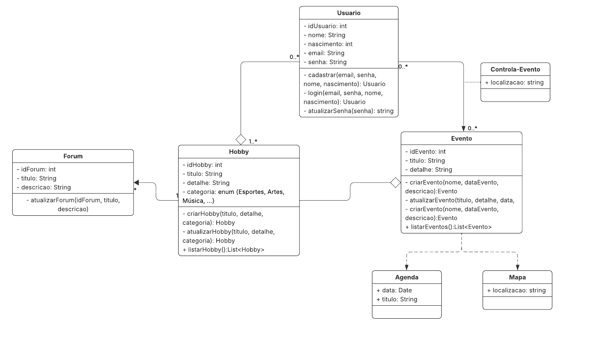

# Revele Seu Hobbie

# Nome do Projeto

**Código da Disciplina**: FGA0208 
**Número do Grupo**: 03 
**Entrega**: 02 

## Alunos
| Matrícula | Aluno |
| -- | -- |
| 23/1011088 | Ana Luiza Soares de Carvalho |
| 23/1026358 | Gabriel Flores Coelho |
| 23/1026385 | Igor Veras Daniel |
| 23/1039113 | Leonardo Porporati Barcellos |
| 22/2006169 | Natan da Cruz Almeida |
| 21/1043763 | Ruan Sobreira Carvalho |
| 23/1039187 | Yzabella Miranda Pimenta |
| 23/1026509 | Matheus de Alcantara da Silva Campos |
| 22/1022408 | Paulo Henrique Lamounier Dantas |
| 21/1031600 | Arthur Augusto Rezende da Paixao |

## Sobre 
O projeto "Revele Seu Hobbie" é uma plataforma inovadora destinada a conectar pessoas com interesses semelhantes, facilitando a descoberta e o compartilhamento de hobbies. Nosso objetivo é criar uma comunidade vibrante onde os usuários possam explorar novos passatempos, participar de eventos relacionados e interagir com outros entusiastas.

## Screenshots da Segunda Entrega

Segue duas fotos de diagramas que foram desenvolvidos ao longo da entrega.

### Diagrama de Sequência

### Diagrama de Classes

## Há algo a ser executado?

( ) SIM

(x) NÃO

Se SIM, insira um manual (ou um script) para auxiliar ainda mais os interessados na execução.

## Informações Complementares

Sem informações adicionais.

## Histórico de Versões

| Versão | Data       | Descrição                                        | Autor(es)           | Revisor(es)         | Comentário do revisor | Data da revisão |
|--------|------------|--------------------------------------------------|---------------------|---------------------|----------------------|-----------|
| `1.0` |  22/09/2025 | Criação do documento |  [Ana Luiza](https://github.com/Ana-Luiza-SC) e [Matheus de Alcântara](https://github.com/matheusdealcantara)  | [Yzabella Pimenta](https://github.com/redjsun) |  Aprovado | 22/09/2025 |